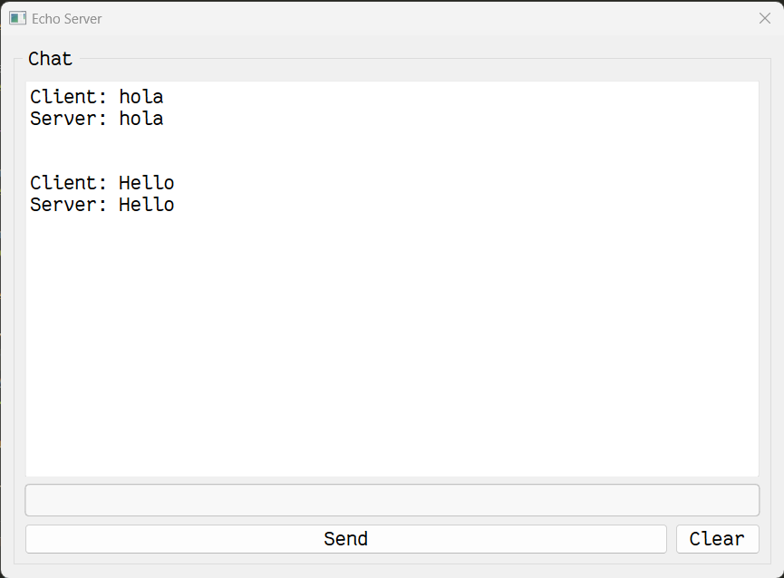

# Echo Server

Echo server using [QLocalSocket](https://doc.qt.io/qt-5/qlocalsocket.html), QLocalServer, and [MessagePack](https://msgpack.org/index.html).



## Development

### Dependencies

- CMake 3.5+
- Qt 6.0.4+
- C++17 compiler

### Build

```bash
cmake . -B build
cmake --build build
```

## Release

```bash
cmake . -B build
cmake --build build --config Release --target ALL_BUILD -j 10
```

## License

Licensed under the [MIT](LICENSE) License.
